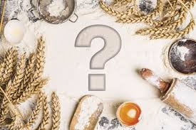
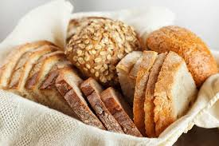

# Glutensiz Beslenme Nedir? Glutensiz Beslenmenin Faydaları ve Zararları Nelerdir?

Glutensiz beslenme hepimizin son zamanlarda oldukça sık duyduğu ve merak ettiği konulardan. Nerdeyse herkes bir şekilde glutensiz beslenme hakkında birşeyler duymuş hatta glutensiz beslenme programını uygulamış durumda. Glutensiz beslenme hakkında gelen onlarca sorulardan sonra diyetisyenimiz [Rüveyda](https://bepilatesyoga.com/ekip/ruveyda-busra-dengiz/) sizler için glutensiz beslenme hakkında kısa bir yazı hazırladı. Keyifli okumalar..

## Glutensiz Beslenme kimler için gerekli?

Glütensiz beslenme son yıllarda oldukça popüler bir hale geldi. Gluten hassasiyeti ya da enteropatisi olan kişilerde ve çölyak hastalarında glütensiz beslenme oldukça önemlidir. Ancak sağlıklı bireylerin de sadece zayıflamak amacıyla glütensiz beslenmesi doğru mu yanlış mı tartışmaları halen devam ediyor.

Çölyak hastası değilseniz veya gluten intoleransınız yoksa gluteni hayatınızdan tamamen çıkarmak bağırsak florasını bozar. Sadece zayıflama amacıyla yapılan gluten kısıtlaması bağırsak düzeninizi bozabilir. Glutensiz beslenmeyi anlayabilmek için öncelikle gluteni anlamak gereklidir. Peki nedir bu glüten?

Glüten, özellikle buğday gibi tahıllarda bulunan bir protein grubudur. Birçok insan glüteni mide-bağırsak kanalıyla sindirebilir. Fakat bazı kişiler glüteni sindiremez. Bu kişiler çölyak hastalığı olarak adlandırılan glüten intoleranslarıdır.

## Glutensiz beslenme mi? Sağlıklı Beslenme mi?

  

Son yapılan çalışmalar glutensiz beslenmenin tip2 diyabet ve kalp krizi riskini arttırdığını gösteriyor!

Normal diyette günde 3 dilim tam tahıllı ekmek eklemek bağırsak kanserine yakalanma riskini azaltıyor!

Buğday, arpa, çavdar ve nişastalı bir çok paketlenmiş pastane ürünü yüksek miktarda gluten içerir. Bu besinleri diyetinizden çıkardığınızda sadece gluteni beslenmenizden çıkarmakla kalmaz aynı zamanda yüksek oranda kalori kısıtlaması yapmış olursunuz.

Yani GLUTENSİZ beslendiğiniz için değil; kalori kısıtladığınız için kilo verirsiniz.

  

Bazı glutensiz ürünlerde firmalar ürünün kıvamını ayarlamak için fazla miktarda şeker ve yağ kullanabilirler.Dolayısıyla besin glutensiz olduğu halde, sağlıklı ya da az kalorili olduğu anlamına gelmez.

Bu anlamda etiket okumaya; besinlerin içeriğinde bulunan basit şeker,yağ ve koruyuculara dikkat edilmeli; glutensiz-light ibareleri olan gıdalar tercih edilmelidir.

Sonuç olarak glüten duyarlılığınız yoksa ve doktorunuz glütensiz beslenmenizi önermiyorsa; zayıflamak için glüteni bırakmanıza gerek yok. İhtiyacınız olan şey uzman bir diyetisyen ile birlikte sizin için uygun olan beslenme programını oluşturmak.

Sağlıklı beslenme yolculuğunda doğru bilinen yanlışlardan sakınmak için siz de geç kalmadan diyetisyenimiz Rüveyda’ dan beslenme danışmanlığı randevunuzu alın!