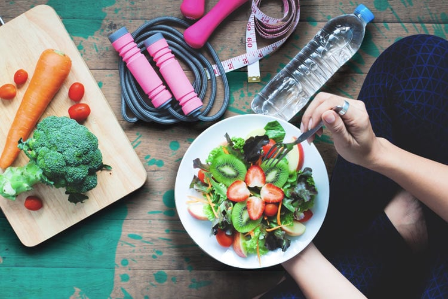
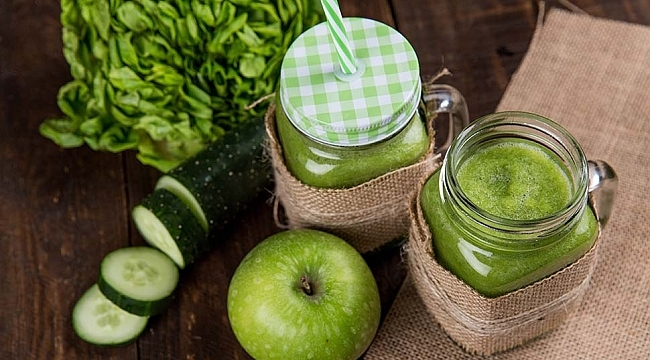
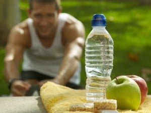

# Metabolizmanız kışa hazır mı?

Kışın gelmesiyle artık sıcak ve ılıman havalara tamamiyle veda ettik..Peki önümüzdeki kışı sağlıklı geçirmek ve metabolizmamızı kışa hazırlamak için şimdilerde neler yapabiliriz?

## C Vitamini bakımından zengin besinler tüketin!

C vitamini; kan damarları, kemikler ve cilt dahil olmak üzere vücutta bağ dokunun sağlığının korunmasında etkili olan ve aynı zamanda antioksidan görevi gören suda eriyen bir vitamindir.

  

Vücutta vitamin C yapılamamaktadır ve depolanmamaktadır. Bu nedenle günlük diyette vitamin C içeren meyve ve sebzelere yer verilmesi oldukça önemlidir.Portakal, greyfurt, mandalina, havuç, kivi gibi kalorileri düşük ancak antioksidan içerikleri yüksek olan meyvelerle bedeninizi ve zihninizi koruyabilir,bağışıklığınızı güçlendirebilirsiniz.

## Sebze ve meyve tüketiminizi arttırın!

Bol sebze ve meyve tüketin. Ispanak, maydonoz, roka gibi yeşil yapraklı sebzelerden tüketin. Taze olarak kahvaltıda veya gün içerisinde tükettiğiniz yeşil yapraklı sebze salataları tüm yorgunluğunuzu almaya yardımcı olacaktır.

  

## Basit karbonhidrat tüketiminizi azaltın!

Kış aylarında kendini koruma altına alan metabolizma yağ depolamaya meyillidir. Bu sebeple daha çok karbonhidrata yöneliriz. Fazla tüketilen karbonhidrat vücutta depo edilen yağın artması,devamlı uyku hali ve yorgunluk olarak bize geri döneceketir. Bu yüzden artan karbonhidrat ihtiyacınızı basit karbonhidratlar yerine kompleks karbonhidratlar dediğimiz tam buğday unlu ekmek, bulgur gibi besinlerden karşılayabilirsiniz.

## Siyah çay ve kahve yerine bitki çayları için!

  

Matcha, beyaz çay, yeşil çay gibi antioksidan içeren bitki çaylarını tüketebilirsiniz. Mevsim geçişlerinde uyku problemi yaşıyorsanız; uyku öncesinde rahatlamak için melisa ve papatya, ödem atmaya yardımcı yeşil çay ve rezene, bağışıklık sistemini güçlendiren hibiskus gibi kış çaylarını tercih edebilirsiniz. Bu çaylara; zencefil, tarçın ve karanfil gibi baharatlar ekleyerek lezzetlendirebilirsiniz.

## Düzenli fiziksel aktivite yapın!

Havaların soğuması ile birlikte fiziksel aktivitenizde azalma olabilir.Güneşten faydalanma süresinin kısalması ve buna bağlı olarak yaşanan depresyon ve anksiyete sizi sosyal hayattan uzaklaştırabilir. Bu durumu atlatmak için güneşli havalarda yürüyüş yaparak ve işin uzmanları tarafından size özel planlanmış egzersiz programları ile metabolizmanızı hızlandırın.

## Bol su tüketin!

Sadece susadığınız zamanlarda değil; sık sık kendinize hatırlatmalar yaparak su tüketin.Susama hissi vücudun susuzluğunun son aşamasıdır.Bu yüzden su içmek için susamayı beklemeyin...

Her ne kadar genel beslenme tavsiyeleri paylaşıyor olsak da, beslenme kişiye özeldir ve özel olarak planlanması gerekir. Diyetisyeniniz ile oluşturabileceğiniz size özel beslenme programıyla yeterli ve dengeli beslenerek metabolizmanızı ve bedeninizi koruyun.