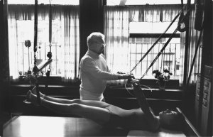

# Pilates nedir?

  

Pilates, 20 yüzyıl’ın başlarında Joseph Hubert Pilates (1880-1967) tarafından geliştirilmiş bir egzersiz yöntemidir. J. H. Pilates’in “contrology” adını verdiği bu eşsiz egzersiz metodu, değişik şekillerde kasların uzamasını ve aynı zamanda güç kazanmasını sağlar. Bedenin dengeli tutulmasına yardımcı olan ve omurgayı desteklemekte önemli işlevi olan temel kaslar üzerine yoğunlaşılan bir egzersiz programıdır. Diğer egzersiz sistemlerinin aksine [pilates](http://www.bepilatesyoga.com/pilates/) iç kaslarımızı ve core dediğimiz vücudun merkez bölgesini güçlendirir. Zihin ve beden bütünlüğü öngören denge, nefes ve hareket sistemlerinin bir sentezidir. Eklem ve kemikleri hayat boyu korumak için kas güçlendiren, esneten ve özellikle içsel karın kaslarının kuvvetlendirilmesi esasına dayanan bir sistemdir.

_Bu yazıyı paylaşarak güzel bilgilerin yayılmasını sağlayabilirsin._

## Pilates nasıl yapılır?

Pilates yerde pilates matı ile yada özel olarak dizayn edilmiş [pilates aletleri](http://www.bepilatesyoga.com/reformer-pilates-aleti-nedir-nasil-calisir/) ile yapılır. Pilates hareketlerinin uygulanmasında en önemli unsur, pilates egzersizlerinin kesin, doğru ve pilates prensiplerine uygun olarak yapılmasıdır.

### Pilatesin 6 temel prensibi ile yapılır

1.  Konsantrasyon,
2.  Kontrol,
3.  Merkezleme,
4.  Akıcı Hareket,
5.  Kesinlik,
6.  Nefes.

> “Sadece 10 derste farkı hissedecek, 20 derste farkı görecek, 30 derste tamamen farklı bir vücuda sahip olacaksınız.” J. H. Pilates

### Aletli Pilates nasıl yapılır?

Aletli pilates özel olarak tasarlanan reformer pilates aleti ile yapılan egzersiz sistemine denir. Pilates prensiplerine bağlı kalınarak reformer aleti ile yapılır. Pilates aletinin kullanılması karışıktır ve pilates eğitimi gerektiri. Günümüzde aletli pilates pilates studyolarında eğitmen nezaretinde yapılmaktadır.

### Mat Pilates nasıl yapılır?

Mat pilates egzersizleri yerde uygulanır ve genellikle pilates matı ile yapılır. Uygulanış bakımından ulaşılabilir olması çok fazla ekipmana ihtiyaç olmaması sebebiyle her yer ve ortamda uygulanabileceği düşünülmektedir. Ancak doğru değildir. Mat Pilates hareketlerini uygulamak için de pilates eğitimi almak gereklidir. Pilates egzersizlerini uygularken sakatlanmamak için bu oldukça önemlidir.

Pilates egzersiz sistemi başlı başına bir sistemdir ve kendine has kuralları vardır. Bu kurallar ve prensipler uygulanmadan pilates haretlerinden verim almak oldukça zordur.

### Pilates ne fayda sağlar?

Pilates bir egzersiz sistemi olmasının yanında sırt, diz, kalça, omuz ve kronik sakatlıkların mükemmel bir rehabilitasyon yöntemidir. Postür bozukluğu olarak nitelendirilen Kifoz, Lordoz, Skoyloz gibi hastalıkların önlenmesi ve tedavisinde en etkili yoldur.

  

Bu egzersizlerin amacı karın ve sırt bölgelerini eşit oranda güçlendirip, vücudumuzun üst kısmında sağlam bir iskelet oluşturmaktır. Eklem ve kemikleri hayat boyu korumak için kas güçlendiren, esneten ve özellikle içsel karın kaslarının kuvvetlendirilmesi esasına dayanan bu sistem ile gelecekte omurgada veya belde oluşabilecek ağrı ve [duruş bozukluklarına](http://www.bepilatesyoga.com/durus-bozuklugu-nedir/) bağlı sakatlanmaları önlemektir. Bu metot vücudun merkezini kuvvetlendirerek kısa bir sürede omurganın dik bir duruş kazanmasını sağlar.

  

## Pilatesin farkı nedir?

Pilates metodunu diğer spor dallarından ayıran en önemli özellik, hareketlerin akciğer ve kalp üzerine aşırı bir baskı uygulamadan omurgayı zorlamadan gerçekleştirilmesidir. Her bir egzersiz çalıştırdığı kasları güçlendirmek ve uzatmak için tasarlanmıştır. Böylece eklemler açılır ve kas gerilimleri yok edilir. Bu egzersiz metodu sert ve ani kas germelerine başvurmak yerine adaleleri uzatıp güçlendirmeye odaklanarak, karın, sırt ve kalça kaslarını kuvvetlendirip, gücünü kaybetmiş kasların yeniden güç kazanmasını sağlar.

## Kimler Pilates yapabilir?

Pilates her yaşa, cinsiyete ve bütün meslek gruplarına hitap eden bir antrenman formudur.  
Başta masa başı çalışanları ve gelişim yaşındaki çocuklar olmak üzere profesyonel dansçı ve sporcular açısından da son derece etkili bir spordur. Herkes pilates yapabilir. Pilatesin yapılmasıyla ilgili bir kısıtlama yoktur. Pilates kişiselleştirilebilin bir egzersizdir ve pilates hareketleri tüm vücutların ihtiyacına göre şekillendirilebilir.