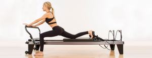

# Pilatesin 6 temel prensibi nelerdir?

Pilates sadece bir egzersiz değildir. Pilates sadece özel hareketlerin rastgele bir seçimi de değildir.  [Pilates](http://www.bepilatesyoga.com/pilates/) fiziksel gücü, esnekliği ve koordinasyonu artıran ve aynı zamanda stresi azaltan, zihinsel odaklanmayı güçlendiren ve besleyen, iyi duyuları geliştiren bir  fiziksel ve zihinsel  kondüsyon sistemidir. Pilates sistemine ilişkin daha önceki yazılarımızda detaylı bilgilendirme yapmıştık. Bunun için [blog sayfamızı](http://www.bepilatesyoga.com/blog/) inceleyebilirsiniz. Bu yazımızda sürekli bahsettiğimiz ve derslerimizde ısrarla hatırlattığımız Pilatesin 6 temel prensibi üzerinde durmak istedik.Keyifle okuyun ve paylaşarak faydalı bilginin yayılmasını sağlayın.

Pilatese yeni başlasanız da, yıllardır bu egzersiz sistemini yapıyor olsanız da tüm hareketlerde ve çalışma seviyelerinde uygulamanız gereken 6 temel prensip;

## Pilates Prensipleri:

### 1.Kontrol

  

Pilates egzersizleri esnasında bedensel güvenliğin ve farkındalığın en önemli ilacı kontroldür. Kişinin tüm bedenini ve diğer bir takım yan unsurları (nefes, ekipman kullanımı, koordinasyon) kontrol altına alabilmelidir. Pek çok şeyi aynı anda düşünerek pilates yapabilmelidir. Bu kontrolün sağlanması için eğitmen derslerin en başından beri kişiyi beden ve zihin bütünlüğüne odaklamalı, ona bu kontrolü eline alabilmesinde rehberlik etmelidir.

> _“İyi bir postür, tüm vücut kontrol altında tutulduğu zaman başarılı bir şekilde kazanılabilir” JOSEPH PİLATES_

### 2.Nefes

  

Yaptığınız hareket nefes şeklinizi, doğru alıp verdiğiniz nefes ise hareket kalitenizi belirler. Yani doğru nefes prensibi pilatesin temel taşlarından biridir ve en baştan itibaren kişiye en önemle öğretilmesi gereken kurallardan biridir. Nefes tutulmayacak ve doğru şekilde alınıp verilecektir. Kanda ve kaslarda eşit miktarda oksijen dağılımı, odaklanma, ağrıya tahammül ve hareketlerin temposunu doğru ayarlamak için nefes baş unsurlardan biridir.

> _“Akciğerlerin tamamen boşaltılması başlı başına bir sanattır ve malesef en önemli adım olan doğru nefes alıp vermek, en az anlaşılanıdır” JOSEPH #PİLATES_

### 3.Akıcılık

  

Pilates egzersizi sırasında hareketler akıcı bir düzene sahiptir. Duraksama olmadan her bir noktadan ayrı ayrı geçerek hareketler tamamlanmalı, ancak bu akıcılık, hızlı olmak ya da ani ve sert hareket etmek anlamına da gelmemelidir. Hareketler yumuşak, akıcı ama bir o kadar da kontrollü olduğunda sağlıklı sonuç alınır. Hafif direnç hissi ile yapılan, yedirerek uygulanan, es geçilmeyen [pilates](http://www.bepilatesyoga.com/pilates/) hareketlerinin bütünü, kişiyi hedefine yaklaştırır.

> _“Bedeni inşa eden, zihnin kendisidir” #JOSEPHPİLATES_

### 4.Merkezleme

  

Tüm hareketler merkezden başlar. Merkez bölge pilates için karın, bel ve kalça bölgesini ifade eder. “Power House” diye de adlandırılabilen bu bölge iç organlarımızı ve omurgamızı yerinde tutan kas sistemlerini içerir. Merkez kuvvetimizin çıkış noktası bu bölgedir. Egzersiz esnasında bu bölgenin güçlenmesi ve bu gücün etkilerinin tüm bedene yayılması çok önemlidir.

> _“Fiziksel olarak iyi hissetmenin, mental rahatlığın, ruhsal barışın kazanımı ve zevki, sahibi için paha biçilmezdir” JOSEPH #PİLATES_

### 5.Kesinlik,Doğruluk

Hareketler belli-belirsiz değil tam net yapılmalıdır. Netlik en önemli unsurlardan biridir. Tüm detaylara dikkat edilmesi gereklidir. [Pilates](http://www.bepilatesyoga.com/pilates/) ayrıntılarda gizlidir, detaylardan oluşur. Ve sonuç da bu detaylar sayesinde gelir, hareketleri doğru yerde hissetmek de bu detaylara dikkat edilmesi sayesinde gelir.

  

> _“Doğru yapılan iki hareket, düşünmeden ve kontrolsüzce yapılan on hareketten daha iyidir” #JOSEPHPİLATES_

### 6.Konsantrasyon

Pilates esnasında tüm benliğimizle, bedenimizle ve zihnimizle orada olmamız gerekir. Kişi başka şeyler düşünerek egzersiz yapmamalıdır. Eğitmenin yönlendirmelerine ve yaptığı harekete odaklanmalıdır. Harekete yoğunlaşmak ve hangi kasların kullanıldığına, hareketi nasıl doğru uygulayacağına odaklanmak ve konsantrasyon, kişiyi amacına ulaştıracaktır.

Pilatesi diğer egzersiz sistemlerinden ayıran en büyük özellik kendine özgü prensipleridir. Yapılan tüm pilates egzersizlerinde yukarıda belirtilen pilates prensipleri atlanmadan uygulanmalıdır. Hareketlerin, hızlı, kontrolsüz yada gelişigüzel yapılışı kısa zamanda elde edilecek faydaları olumsuz yönde etkileyecektir. Keyifli sporlar…