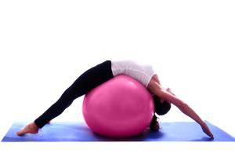

# Pilatesin faydaları nelerdir?

Bu yazımızda pilatesin faydaları ve bilinmeyen birçok etkisini ele aldık. [Pilates](http://www.bepilatesyoga.com/pilates/) diğer egzersiz metodolojilerine oranla insan sağlığına olan faydaları ve olumlu etkili ispatlanmış ve hatta bir çok hastalığın tedavisinde uygulanmış bir egzersiz sistemidir. Pilates’in kurucusu Joseph Hubert Pilates (1880-1967) Pilates hareket sistemi ile, I. Dünya Savaşı sırasında bir rehabilitasyon yöntemi olarak askerleri tedavi ve rehabilite etmiştir.

_Bu yazıyı paylaşarak güzel bilgilerin yayılmasını sağlayabilirsin._

> “Pilates vücut eğitimi, vücut istikrarınızı geliştirir, duruşunuzu düzeltir, gücünüzü arttırır, zihninizi ve ruhunuzu canlandırır. ” Joseph H. Pilates

[Pilates](http://www.bepilatesyoga.com/pilates/) hem zihinsel hem de bedensel kontrolü hedeflemektedir. Akıcı pilates hareketleri nefes, beden, ve zihin kontrolünü  sağlamayı hedeflemektedir. Düzenli olarak yapılan pilates bedenin daha esnek, kontrollü ve konsantrasyonu yüksek olmasını sağlamaktadır. Pilatesin faydaları saymakla bitmez. Pilates egzersizleri bugün fizik tedavi uzmanları, doktorlar ve sağlık bilimciler tarafından tavsiye edilmektedir.

## Pilatesin Sağlığa Faydaları

Pilates neredeyse vücudunuzdaki bütün kasları çalıştırırken onlara esnek bir görünüm sağlar. Diğer sporların aksine pilates kaslarınızı güçlendirirken şişkin kas görünümüne sebep olmaz. Dansçılar ve balerinler ile jimnastikçiler bu nedenle pilatesi tercih etmektedirler. Vücudumuzda yer alan dengeleyici kasların güçlenmesine bu sayede de vücut dengesinin sağlanmasına yarar gösterir.

Pilates egzersizleri ayrıca zihin için de vücut için olduğu kadar faydalı olup stresten uzaklaştırır, vücudu rahatlatır. Kontrollü ve tam konsantrasyon ile yapılan bir spor olduğundan dengeyi geliştirir, zihni açar ve dinlendirir. Pilates kişinin vücudunu tanımasına yardımcı olur. Vücudunun ne kadar güçlü, esnek ya da kontrollü, dengeli olduğu konusunda bilinçlenmesini sağlar.

  

Bayanlarda özellikle karın, basen ve kollar zayıf kaslardır ve yağlar da bu bölgelerde birikir. İlerleyen dönemlerde kilo alıp verme ya da hamilelikten sonra yine bu bölgelerde sarkmalar görülebilmektedir. Bu sarkmaların toparlanması, yağların yakılması ve yine bu bölgelerde ki kasların güçlenmesi pilatesin en büyük yararları arasında yer almaktadır. Pilates göbek sorunu olanların da yine göbeklerini sağlıklı eritmelerini sağlamakla birlikte sıkılaşma da fayda sağlamaktadır.

Düzenli olarak uzman eğitmenler gözetiminde yapılan pilates hareketleri kasların esneklik kazanması ve güçlenmesi için tartışmasız en iyi tercihtir. Pilates hareketleri ile esneklik kazanan vücut daha seri ve aktif hareket etmeye başlar. Kan dolaşımını hızlandırır, damar tıkanıklığının önüne geçer ve kalp krizi riskini azaltır. Yine kan dolaşımının düzenli olması kalbin daha aktif ve verimli çalışmasını da destekler.

Pilates çalışmaları vücudun stresten uzaklaşmasına fayda sağlar. Stresten arınan beden daha enerjik olur. Stres kaynaklı rahatsızlıkların son bulmasına yardımcı olur. Kişinin daha kontrollü ve dengeli hareket etmesine yardımcı olur. [Pilates](http://www.bepilatesyoga.com/pilates/) eklemlerin daha iyi çalışmasını sağlar. Omurga sisteminde ki eğriliklerin zaman içerisinde düzelmesini sağlayarak kişinin duruşunu düzeltir. Omurga yapısının daha esnek ve sağlam olmasını sağlar.

## Pilatesin yapanların elde ettiği faydalar

### Pilates egzersizleri ile tüm vücudunuzda kas gelişimi sağlarsınız

Pilates hareketleri vücudun sadece bir kısmını veya bazı organları hedeflemez. Bütün vücudu ve organları içeren yüzerce pilates hareketi içerir. Pilatesin bu özelliği sayesinde kaslar dahil eklemlerin esnekliğini sağlar ve kas ve kemik yapısının sağlığının korunmasına yarar sağlar.

Vücudumuzda bulunan kaslar kullanılmadığında zamanla güçlerini yitiriler, hatta tamamen fonksiyonlarını yitirebilirler. Özellikle her gün aynı işleri yapmak zorunda olan kişilerde bu sorunlar sık rastlanır. Örneğin günde 8 saat bilgisayar karşısında çalışmak zorunda olan kişilerde uzun yıllar sonra kullanılmayan kaslar alarm vermeye başlar, aynı şey sürekli saatlerce aynı hareketi yapan kaslar için de geçerlidir. Hareketsiz kalan kaslar güç kaybederek deforme olmaya başlarlar. Fakat pilatesin sunduğu egzersizler, bu tür sorunları ortadan kaldırabilir. Pilates hareketleri düzenli olarak uygulandığında kasların güç kaybına uğramasını engeller ve kas yapısında katkıda bulunur.

### Pilates hareketleri sizi zinde ve enerjik tutar

Düzenli olarak yapılan pilates egzersizleri vücudu zinde tutar. Pilates siteminde bulunan 500 hareket neredeyse her yaştan kişiye hitap etmektedir. Bu yüzden yaşlılık döneminde bile uygulanabilmektedir. Pilates çalışmalarının farklı eğitim düzeyleri yardımıyla bütün bir ömür boyu uygulanması mümkün olduğu için yaşlanmadan kaynaklanan güç kaybını geciktirir.

Pilates hareketlerini uygulamak aynı zamanda vücutta enerji akışını arttırır. Bu da, enerji düzeyinin artmasını sağlar. Yapılan egzersizler solunum, kan dolaşımı, omurga sağlığını ve hatta ruh sağlığını korur. Bütün bunların bir arada olması da enerji seviyesinin maksimuma çıkmasını sağlayabilir.

Modern dünya’da özellikle hareketsizliğin neden olduğu kas hastalıkları oranı giderek artmaktadır. Teknolojinin getirdiği yenilikler bir çok yeni hastalıkların ortaya çıkmasına neden olduğu gibi uzun süre aynı işlevi yapan kişilerde kas ağrılarına neden olabilmektedir. Düzenli olarak pilates egzersizleri yapmak aynı zamanda bu hastalıklara yakalanma riskini azaltabilidiği gibi, kas ağrılarından kısa sürede kurtulmayı sağlayabilir.

### Pilates çalışmaları sıkı ve yağsız kasların oluşmasına yararlıdır

Aldığımız yüksek miktarda besinler ve düzensiz beslenmemiz kasların yağlanmasına neden olabilir. Düzensiz beslenme ile kaslarımız yağlanır ve kilo alırız. Pilates hareketlerini düzenli olarak uyguladığımızda kaslarımız hareket eder, kalori harcarız,  yağsız ve doğal kasların sahibi oluruz.

Pilatesin temelinde vücudun esnekliğini geliştirmek için kas liflerini germe işlemi vardır. Kas lifleri gerilerek vücut esnekliği korunur. Özellikle kemikli yapıya sahip kişilerde vücut esnekliğini sağlamak zor bir durumdur, bu durumda pilates egzersizleri işe yarayabilir. Bunun yanında pilates genel anlamda kas esnekliğini geliştirerek yaşam akışının gereksinimlerini karşılamaya yardımcı olur.

Pilates egzersiz çeşitlerinin bir çok faydası dışında kilo vermeye yardımcı olduğunu söylemek mümkün. Düzenli olarak ve sürekli yapılması durumunda kilonunun korunmasına yardımcı olur.

Pilates hareketleri genel anlamda bütün kas yapısına faydalıdır ama görünüş olarak kalça ve karın kaslarının sağlığına ciddi anlamda fayda sağlar. Kaslardaki yağ oranının azalmasını sağlayarak estetik bir vücut sahibi olmanıza yardımcı olabilir.

### Pilates egzersiz çalışmaları ruh ve sinir sağlığınızı iyileştirir, denge yeteneğinizi geliştirir

Vücudumuzun her yerinde bulunan kas sağlığı aynı zamanda denge açısından da önemlidir. Kaslardaki yağ oranındaki denge aynı zamanda görünümü etkiler. Kalça, basenler ve karın kısmındaki dengenin oluşmasına yardımcı olur. Bunun yanında aletlerle yapılan pilates ezgersizleri vücut denge sağlığının korunmasına faydalı olmaktadır.

Her ne sebepten olursa olsun bünyemiz özellikle sinir sistemimiz olumsuz enerjilerin saldırısına maruz kalmaktadır. Sağlık uzmanları zararlı enerjinin bünye dışına atılmasına doğa ve sporun yardımcı olabileceğini söylemektedirler. Bu açıdan bakıldığında pilates pratiği zihnimizi meşgul eden olumsuz düşüncelerden kurtulmamıza, sinir ve ruh sağlığımızı korumamıza yarar sağlar.

Onca yararlarının yanında pilatesin yanlış uygulanması sağlık problemlerine neden olabileceği göz ardı edilmemeli ve uzman pilates eğitmenleri eşliğinde yapılmalıdır.