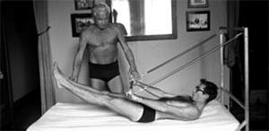
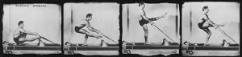
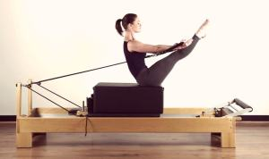

# Reformer Pilates Nedir?

  

Pilates’in ne olduğunu, faydalarını ve dikkat çeken noktalarını daha önceki [yazılarımızda](http://www.bepilatesyoga.com/blog/) sizlere kısaca bahsetmiştik. Pilates egzersiz metodolojisinin en önemli unsurlarından birisi olan [Reformer Pilates](http://www.bepilatesyoga.com/reformer-pilates/), yine kurucusu **Joseph Hubert Pilates** tarafından tasarlanan ve ilk versiyonlarıyla çalışmalar yapılan pilates egzersiz cihazı ve bu cihazla yapılan egzersiz disiplinini ifade eder. Ülkemizde [aletli pilates](http://www.bepilatesyoga.com/aletli-pilates/) olarak da bilinen reformer pilates yaklaşık 100 yıllık bir spor disiplidir.

_Keyifle okuyun ve paylaşarak güzel bilgilerin yayılmasını sağlayın._ 

## Reformer Pilates Nasıl Yapılır?

Reformer pilates farklı direnç seviyelerine karşı yapılan çok çeşitli egzersizler ile kasları güçlendirmeye ve omurgayı düzeltmeye yardımcı olur. Oturur veya yatar pozisyonda, reformer üzerindeki vücudun farklı bölgelerini çalıştırmaya yarayan çeşitli aparatlar ile vücudun hemen her kas grubunu çalıştırmak mümkündür. Dolayısıyla reformer pilates, günlük hayatta veya başka egzersizlerde çok fazla kullanamadığımız kasları çalıştırması itibariyle sağlıklı bir beden için tercih edilebilecek en iyi egzersizlerden biridir.

### Reformer pilates aleti nedir?

Reformer pilates, çoğu yerde aletli pilates olarak adlandırılır. [Reformer pilates aleti](http://www.bepilatesyoga.com/reformer-pilates-aleti-nedir-nasil-calisir/) Joseph Pilates tarafından geliştirilen ve savaşta yaralanan askerler için kurduğu bir düzenektir. Tabii ki günümüzdeki reformer aleti Joseph Pilates’in kullandığı aletten çok daha gelişmiş bir durumdadır. Düz bir platformu vardır. Üzerinde yatılan yeri taşıyıcı, ayaklarımızı koyduğumuz footbar, omuzlarımızı dayadığımız omuz blokları, boynumuzu koyduğumuz boyunluklar, yaylar ve elciklerden oluşur. Taşıyıcıyı hareket ettirebilmek için ellerden ve ayaklardan çekilip itilebilir.

  

### Kimler Reformer Pilates Yapmalıdır?

Reformer pilatesi herkes yapabilir. Reformer kelimesi yeniden forma dönüş anlamına gelmektedir. Joseph Pilates, pilates egzersizlerini  sağlıklı bir vücudu hedefleyen tüm bireyler için tasarlamıştır. Bayanlar, erkekler, her yaştan insan grubu çeşitli sağlık problemi olanlar da reformer pilates yapabillir. Her bireyin yapacağı reformer pilates egzersizi oldukça farklı olabilir. Sadece sağlık problemlerine ilişkin akut dönemlerde yapılmamasına dikkat edilmelidir. Akut dönemden kastımız ağrılı regl dönemleri ,yine anlık bel ve boyun ağrılarıdır. Akut dönemlerde rahatsızlığın kaynağı doğru tespit edilemeyeceğinden bu dönemlerde pilates tavsiye edilmemektedir.

Özellikle reformer pilatesi yapması gereken kişiler; bel fıtığı, boyun fıtığı,omurga problemi olanlar, [duruş bozukluğu](http://www.bepilatesyoga.com/durus-bozuklugu-nedir/) olanlar(kifoz, skolyoz, lordoz)dır. Tabii ki bunların haricinde daha sıkı ve esnek bir vücuda sahip olmak isteyenler de yapmalıdır.

Reformer pilatesin erkekler için uygun olmadığı kanısı kesinlikle yanlıştır. Sadece kadınların yaptığı bir egzersiz değidir. Sadece kadınların daha çok ilgisi olması böyle bir algıyı doğurmuştur. Pilates, genel anlamda duruş bozukluklarını iyileştirmesi ve düzeltmesiyle ilgili bir egzersiz olduğu için ve erkekler de bu durumdan fazla şikayetçi olduğu için pilatesi zaten yapmalılardır. Pilates egzersizlerinin cephede savaşan askerler üzerinde uygulandığı ve geliştirildiği unutulmamalıdır.

Reformerı genellikle 15 yaşından büyük bireylerin yapmasını tavsiye etmekteyiz. 15 yaşından küçük olan kişilerin reformer pilates değil de mat pilates yapmaları daha doğru olacaktır.

  

### Reformer pilatesin faydaları nelerdir?

*   Omurga problemlerini azaltır ve iyileştirir.
*   Esneklik kazandırır.
*   Pelvik taban kaslarını güçlendirir.
*   Postürü(duruşu) düzeltir. Gün içinde dik durmanızı sağlar.
*   Vücudu sıkılaştırır, şekillendirir.
*   Daha güçlü bir vücuda sahip olmanızı sağlar.
*   Hareket kabiliyetini arttırır.
*   Omuz, sırt ağrısı, bel ağrısı gibi problemlere iyi gelir.
*   Reformer pilateste 100’den fazla hareket yaparsınız.
*   Vücut rahatlar ve kendinizi daha hafif hissedersiniz.
*   Alt karın kaslarını sıkılaştırır.
*   Vücudun daha dengeli olmasını sağlar.
*   Nefesi düzenler.
*   Reformer pilates sayesinde normalde yapamadığınız pilates hareketlerini iplerle direnç uygulayarak daha kolay yapabilirsiniz.
*   Stresi azaltır.
*   Kan dolaşımı hastalıkları ve eklem rahatsızlıklarının oluşmasını engeller.

## Mat Pilates ve Reformer Pilates Arasındaki Farklar

### Mat pilatesin başlıca özellikleri

*   #### Mat pilateste sadece yerçekime karşı koyarsınız.

Mat üzerinde yapılan pilates egzersizlerinde yerçekimine karşı koyacak tek şey bedeninizdir. Bu yüzden de kontrol ve hareketin verimliliği dengenize ve konsantrasyonunuza bağlıdır. Hareketi yaparken dayanma gücünüz ve kontrol yeteneğiniz ne kadar fazla olursa pilates hareketi okadar verimli olur.

*   #### Tüm kas gruplarını çalıştırır.

Mat egzersizlerinde tüm kasları çalıştıracak hareket versiyonları vardır. Bu hareketleri top, lastik veya çemberle destekleyerek daha fazla kas çalıştırılabilir.

*   #### Mat pilates grup dersleri, kalabalık ders yapmayı sevenler için idealdir.

Mat pilates, genellikle grup halinde yapılan bir egzersizdir. Tek başına spor yapmaktan sıkılan, sosyal çevre edinmek isteyen ve kalabalık ders yapmaktan hoşlanan kişiler için mat pilates ideal olacaktır.

Mat pilates dersleri, grup psikolojisiyle kişinin motivasyonunu yüksek tutmasını sağlar. Derslere daha istekli ve azimli gelmeye başlarlar.

*   #### Malzeme olarak sadece pilates matı gerektirir.

Mat pilatesi yaparken ihtiyacınız olacak malzeme mat minderi olacaktır. Tabii ki yardımcı pilates malzemeleri olarak top, lastik, çember de kullanırız. Taşınması da kolaydır. Eğer kendi mat minderinizi kullanmak istiyorsanız bu açıdan da kolaylık sağlar.

*   #### Daha uygun ders paketleri olanağı sağlar.

Birebir özel ders olmadığı ve belli bir saatte toplulukla yapıldığından dolayı maliyet açısından daha uygundur.

### **Reformer Pilatesin başlıca özellikleri**

Reformer aletini Pilates’in yaralı askerlerin yataklarına yay takarak bulduğunu biliyoruz. Bu da yukarıda belirttiğimiz gibi zamanla geliştirilerek günümüzdeki halini almıştır.

*   #### Reformer, kısa sürede değişim için bire birdir.

Kişinin vücut ağırlığı farklı yaylarla desteklendiğinden dolayı bu direnç sistemiyle kasların tam anlamıyla çalışmasına yardımcı olur.

*   #### Ücretleri mat pilatese göre daha maliyetlidir.

Kısa zamanda verdiği sonuca bakacak olursak daha kısa sürede fit bir vücut ve verimli bir zaman geçirecek olmak maliyetin önüne geçecektir.

*   #### Genellikle birebir eğitim olduğu için özellikle omurga rahatsızlıklarında etkilidir.

Birebir eğitim her zaman daha etkilidir. Eğitmen sizin isteklerinize ve rahatsızlıklarınıza göre size bir program yapıp çalıştıracaktır. Böylece istediğiniz sonuca daha sağlıklı ve hızlı ulaşmış olursunuz.